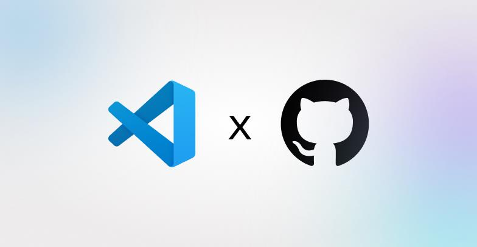

<p align="center" style="text-align:center">
  
  
</p>

> 🔱 **Fork Notice:** Murena is an enhanced fork of [oraios/serena](https://github.com/oraios/serena) with performance improvements, extended tool support, and optimizations for large-scale projects.

* :rocket: Murena is a powerful **coding agent toolkit** capable of turning an LLM into a fully-featured agent that works **directly on your codebase**.
  Unlike most other tools, it is not tied to an LLM, framework or an interface, making it easy to use it in a variety of ways.
* :wrench: Murena provides essential **semantic code retrieval and editing tools** that are akin to an IDE's capabilities, extracting code entities at the symbol level and exploiting relational structure. When combined with an existing coding agent, these tools greatly enhance (token) efficiency.
* :free: Murena is **free & open-source**, enhancing the capabilities of LLMs you already have access to free of charge.

You can think of Murena as providing IDE-like tools to your LLM/coding agent. 
With it, the agent no longer needs to read entire files, perform grep-like searches or basic string replacements to find the right parts of the code and to edit code. 
Instead, it can use code-centric tools like `find_symbol`, `find_referencing_symbols` and `insert_after_symbol`.

<p align="center">
  <em>Murena is under active development! See the latest updates, upcoming features, and lessons learned to stay up to date.</em>
</p>

<p align="center">
  <a href="CHANGELOG.md"></a>
  <a href="roadmap.md"></a>
  <a href="lessons_learned.md"></a>
</p>

> [!TIP]
> The [**Murena JetBrains plugin**](#the-murena-jetbrains-plugin) has been released!

## LLM Integration

Murena provides the necessary [tools](https://oraios.github.io/murena/01-about/035_tools.html) for coding workflows, but an LLM is required to do the actual work,
orchestrating tool use.

In general, Murena can be integrated with an LLM in several ways:

* by using the **model context protocol (MCP)**.
  Murena provides an MCP server which integrates with
    * Claude Code and Claude Desktop,
    * terminal-based clients like Codex, Gemini-CLI, Qwen3-Coder, rovodev, OpenHands CLI and others,
    * IDEs like VSCode, Cursor or IntelliJ,
    * Extensions like Cline or Roo Code
    * Local clients like [OpenWebUI](https://docs.openwebui.com/openapi-servers/mcp), [Jan](https://jan.ai/docs/mcp-examples/browser/browserbase#enable-mcp), [Agno](https://docs.agno.com/introduction/playground) and others
* by using [mcpo to connect it to ChatGPT](docs/03-special-guides/murena_on_chatgpt.md) or other clients that don't support MCP but do support tool calling via OpenAPI.
* by incorporating Murena's tools into an agent framework of your choice, as illustrated [here](docs/03-special-guides/custom_agent.md).
  Murena's tool implementation is decoupled from the framework-specific code and can thus easily be adapted to any agent framework.

## Multi-Project Support

Murena MCP supports running multiple independent instances, allowing you to work seamlessly across multiple codebases in a single Claude Code session.

### Quick Setup

```bash
# Auto-discover and configure all Murena projects
murena multi-project setup-claude-code

# Restart Claude Code to load the new MCP servers
```

This creates separate MCP server instances for each project (e.g., `murena-serena`, `murena-spec-kit`), each with:
- **Isolated language servers** - No interference between projects
- **Independent memory** - Project-specific knowledge and context
- **Separate caches** - Symbol caches for fast lookups

### Usage Example

Work with multiple projects in the same conversation:

```python
# Work with serena project
mcp__murena-serena__get_symbols_overview(relative_path="src/murena/agent.py")

# Work with spec-kit project
mcp__murena-spec-kit__find_symbol(name_path_pattern="SpecKitManager")

# Cross-project operations in one session!
```

**📖 Full Guide:** See [docs/multi_project_setup.md](docs/multi_project_setup.md) for complete documentation, advanced configuration, and troubleshooting.

## Murena in Action

#### Demonstration 1: Efficient Operation in Claude Code

A demonstration of Murena efficiently retrieving and editing code within Claude Code, thereby saving tokens and time. Efficient operations are not only useful for saving costs, but also for generally improving the generated code's quality. This effect may be less pronounced in very small projects, but often becomes of crucial importance in larger ones.

https://github.com/user-attachments/assets/ab78ebe0-f77d-43cc-879a-cc399efefd87

#### Demonstration 2: Murena in Claude Desktop

A demonstration of Murena implementing a small feature for itself (a better log GUI) with Claude Desktop.
Note how Murena's tools enable Claude to find and edit the right symbols.

https://github.com/user-attachments/assets/6eaa9aa1-610d-4723-a2d6-bf1e487ba753

## Programming Language Support & Semantic Analysis Capabilities

Murena provides a set of versatile code querying and editing functionalities
based on symbolic understanding of the code.
Equipped with these capabilities, Murena discovers and edits code just like a seasoned developer
making use of an IDE's capabilities would.
Murena can efficiently find the right context and do the right thing even in very large and
complex projects!

There are two alternative technologies powering these capabilities:

* **Language servers** implementing the language server Protocol (LSP) — the free/open-source alternative.
* **The Murena JetBrains Plugin**, which leverages the powerful code analysis and editing
  capabilities of your JetBrains IDE.

You can choose either of these backends depending on your preferences and requirements.

### Language Servers

Murena incorporates a powerful abstraction layer for the integration of language servers
that implement the language server protocol (LSP).
The underlying language servers are typically open-source projects (like Murena) or at least freely available for use.

With Murena's LSP library, we provide **support for over 30 programming languages**, including
AL, Bash, C#, C/C++, Clojure, Dart, Elixir, Elm, Erlang, Fortran, Go, Groovy (partial support), Haskell, Java, Javascript, Julia, Kotlin, Lua, Markdown, MATLAB, Nix, Perl, PHP, PowerShell, Python, R, Ruby, Rust, Scala, Swift, TOML, TypeScript, YAML, and Zig.

> [!IMPORTANT]
> Some language servers require additional dependencies to be installed; see the [Language Support](https://oraios.github.io/murena/01-about/020_programming-languages.html) page for details.

### The Murena JetBrains Plugin

As an alternative to language servers, the [Murena JetBrains Plugin](https://plugins.jetbrains.com/plugin/28946-murena/)
leverages the powerful code analysis capabilities of your JetBrains IDE. 
The plugin naturally supports all programming languages and frameworks that are supported by JetBrains IDEs, 
including IntelliJ IDEA, PyCharm, Android Studio, WebStorm, PhpStorm, RubyMine, GoLand, CLion, and others.
Only Rider is not supported.

<a href="https://plugins.jetbrains.com/plugin/28946-murena/"></a>

The plugin offers the most robust and most powerful Murena experience.  
See our [documentation page](https://oraios.github.io/murena/02-usage/025_jetbrains_plugin.html) for further details and instructions.

## Quick Start

**Prerequisites**. Murena is managed by *uv*. If you don’t already have it, you need to [install uv](https://docs.astral.sh/uv/getting-started/installation/) before proceeding.

**Starting the MCP Server**. The easiest way to start the Murena MCP server is by running the latest version from GitHub using uvx.
Issue this command to see available options:

```bash
uvx --from git+https://github.com/oraios/murena murena start-mcp-server --help
```

**Configuring Your Client**. To connect Murena to your preferred MCP client, you typically need to [configure a launch command in your client](https://oraios.github.io/murena/02-usage/030_clients.html).
Follow the link for specific instructions on how to set up Murena for Claude Code, Codex, Claude Desktop, MCP-enabled IDEs and other clients (such as local and web-based GUIs). 

> [!TIP]
> While getting started quickly is easy, Murena is a powerful toolkit with many configuration options.
> We highly recommend reading through the [user guide](https://oraios.github.io/murena/02-usage/000_intro.html) to get the most out of Murena.
> 
> Specifically, we recommend to read about ...
>   * [Murena's project-based workflow](https://oraios.github.io/murena/02-usage/040_workflow.html) and
>   * [configuring Murena](https://oraios.github.io/murena/02-usage/050_configuration.html).

## User Guide

Please refer to the [user guide](https://oraios.github.io/murena/02-usage/000_intro.html) for detailed instructions on how to use Murena effectively.

## Community Feedback

Most users report that Murena has strong positive effects on the results of their coding agents, even when used within
very capable agents like Claude Code. Murena is often described to be a [game changer](https://www.reddit.com/r/ClaudeAI/comments/1lfsdll/try_out_murena_mcp_thank_me_later/), providing an enormous [productivity boost](https://www.reddit.com/r/ClaudeCode/comments/1mguoia/absolutely_insane_improvement_of_claude_code).

Murena excels at navigating and manipulating complex codebases, providing tools that support precise code retrieval and editing in the presence of large, strongly structured codebases.
However, when dealing with tasks that involve only very few/small files, you may not benefit from including Murena on top of your existing coding agent.
In particular, when writing code from scratch, Murena will not provide much value initially, as the more complex structures that Murena handles more gracefully than simplistic, file-based approaches are yet to be created.

Several videos and blog posts have talked about Murena:

* YouTube:
    * [AI Labs](https://www.youtube.com/watch?v=wYWyJNs1HVk&t=1s)
    * [Yo Van Eyck](https://www.youtube.com/watch?v=UqfxuQKuMo8&t=45s)
    * [JeredBlu](https://www.youtube.com/watch?v=fzPnM3ySmjE&t=32s)

* Blog posts:
    * [Murena's Design Principles](https://medium.com/@souradip1000/deconstructing-murenas-mcp-powered-semantic-code-understanding-architecture-75802515d116)
    * [Murena with Claude Code (in Japanese)](https://blog.lai.so/murena/)
    * [Turning Claude Code into a Development Powerhouse](https://robertmarshall.dev/blog/turning-claude-code-into-a-development-powerhouse/)

## Acknowledgements

### Sponsors

We are very grateful to our [sponsors](https://github.com/sponsors/oraios) who help us drive Murena's development. The core team
(the founders of [Oraios AI](https://oraios-ai.de/)) put in a lot of work in order to turn Murena into a useful open source project. 
So far, there is no business model behind this project, and sponsors are our only source of income from it.

Sponsors help us dedicating more time to the project, managing contributions, and working on larger features (like better tooling based on more advanced
LSP features, VSCode integration, debugging via the DAP, and several others).
If you find this project useful to your work, or would like to accelerate the development of Murena, consider becoming a sponsor.

We are proud to announce that the Visual Studio Code team, together with Microsoft’s Open Source Programs Office and GitHub Open Source
have decided to sponsor Murena with a one-time contribution!

<p align="center">
  
</p>

### Community Contributions

A significant part of Murena, especially support for various languages, was contributed by the open source community.
We are very grateful for the many contributors who made this possible and who played an important role in making Murena
what it is today.

### Technologies
We built Murena on top of multiple existing open-source technologies, the most important ones being:

1. [multilspy](https://github.com/microsoft/multilspy).
   A library which wraps language server implementations and adapts them for interaction via Python.
   It provided the basis for our library Solid-LSP (`src/solidlsp`).
   Solid-LSP provides pure synchronous LSP calls and extends the original library with the symbolic logic
   that Murena required.
2. [Python MCP SDK](https://github.com/modelcontextprotocol/python-sdk)
3. All the language servers that we use through Solid-LSP.

Without these projects, Murena would not have been possible (or would have been significantly more difficult to build).

## Customizing and Extending Murena

It is straightforward to extend Murena's AI functionality with your own ideas.
Simply implement a new tool by subclassing
`murena.agent.Tool` and implement the `apply` method with a signature
that matches the tool's requirements.
Once implemented, `MurenaAgent` will automatically have access to the new tool.

It is also relatively straightforward to add [support for a new programming language](/.murena/memories/adding_new_language_support_guide.md).

We look forward to seeing what the community will come up with!
For details on contributing, see [contributing guidelines](/CONTRIBUTING.md).
